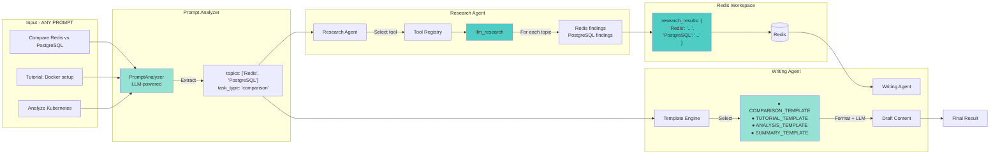
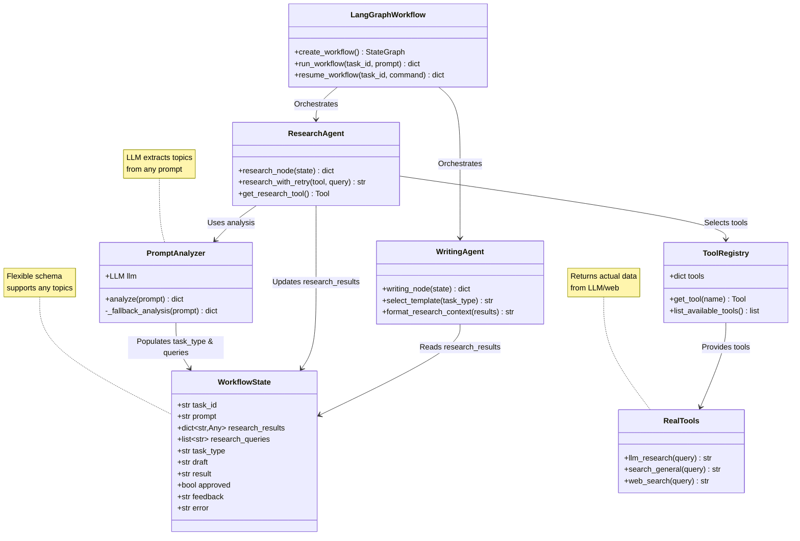
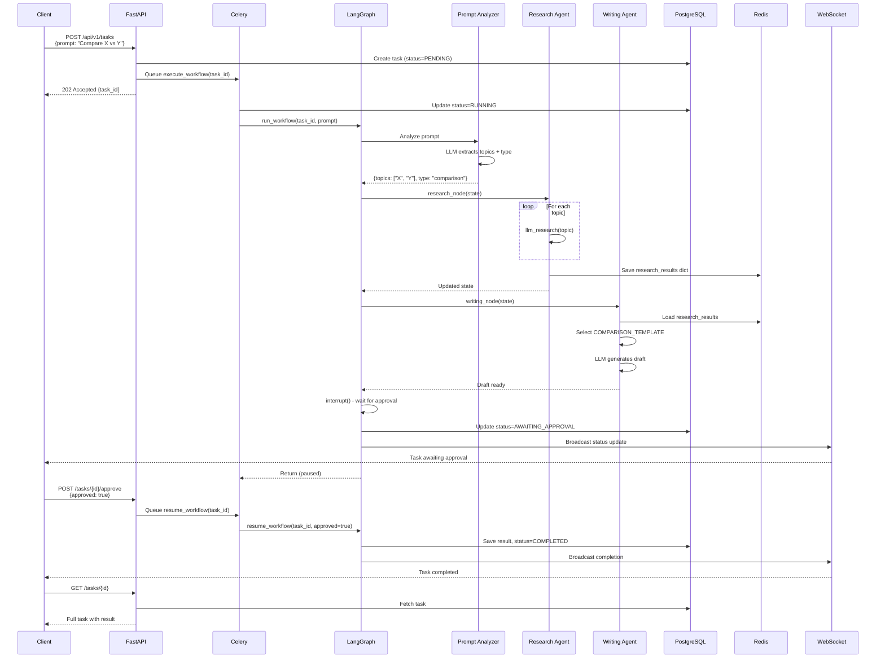

# Multi-Agent System Architecture

> **General-Purpose Framework**: This system dynamically handles ANY research topic and task type using LLM-guided prompt analysis.

## System Overview

```mermaid
graph TB
    subgraph "Multi-Agent System - General Purpose"
        User[User] -->|Any Prompt| API[FastAPI API]
        API -->|Create Task| DB[(PostgreSQL)]
        API -->|Queue Task| Celery[Celery Worker]
        
        Celery -->|Execute| Workflow[LangGraph Workflow]
        
        subgraph "Dynamic Workflow"
            Workflow --> Analyzer[Prompt Analyzer<br/>LLM-guided]
            Analyzer -->|topics + task_type| Research[Research Agent]
            
            Research -->|Select Tool| ToolRegistry[Tool Registry]
            ToolRegistry -->|Real Search| RealTool[LLM Research Tool]
            RealTool -->|Actual Data| Redis2[(Redis Workspace)]
            
            Redis2 --> Writing[Writing Agent]
            Writing -->|Select Template| TemplateEngine[Template Engine]
            TemplateEngine -->|Dynamic Prompt| LLM[LLM]
            LLM --> Draft[Draft Content]
            
            Draft --> Approval[Human Approval<br/>Interrupt/Resume]
            Approval -->|Approved| Finalize[Finalize]
        end
        
        Finalize --> DB
        API -.->|WebSocket| User
    end
    
    style ToolRegistry fill:#4ecdc4
    style RealTool fill:#4ecdc4
    style Analyzer fill:#95e1d3
    style TemplateEngine fill:#95e1d3
```



## Complete Task Lifecycle

```mermaid
stateDiagram-v2
    [*] --> PENDING: POST /api/v1/tasks
    PENDING --> RUNNING: Celery picks up task
    RUNNING --> ANALYZING: Prompt Analyzer
    
    state ANALYZING {
        [*] --> ParsePrompt: LLM analyzes prompt
        ParsePrompt --> ExtractTopics: Extract research topics
        ExtractTopics --> DetermineType: comparison/tutorial/analysis/summary
        DetermineType --> [*]
    }
    
    ANALYZING --> RESEARCHING: Research Agent
    
    state RESEARCHING {
        [*] --> SelectTool: Get tool from registry
        SelectTool --> ResearchLoop: For each topic
        ResearchLoop --> RealSearch: Call LLM research tool
        RealSearch --> SaveResults: Save to research_results dict
        SaveResults --> [*]
    }
    
    RESEARCHING --> WRITING: Writing Agent
    
    state WRITING {
        [*] --> LoadResults: Get research_results from Redis
        LoadResults --> SelectTemplate: Based on task_type
        SelectTemplate --> BuildPrompt: Format template with research
        BuildPrompt --> LLMCall: Generate with LLM
        LLMCall --> [*]
    }
    
    WRITING --> AWAITING_APPROVAL: Draft ready
    AWAITING_APPROVAL --> RESUMED: POST /tasks/{id}/approve
    RESUMED --> COMPLETED: Save result to DB
    AWAITING_APPROVAL --> FAILED: Rejected or error
    COMPLETED --> [*]
    FAILED --> [*]
```



## Data Flow: From Prompt to Result



## Component Architecture



## API Integration Flow



## Technology Stack

### Core Framework
- **FastAPI**: Async REST API
- **LangGraph**: Multi-agent workflow orchestration
- **Celery**: Async task queue
- **PostgreSQL**: Task persistence
- **Redis**: Agent workspace & message broker

### AI/ML
- **LangChain**: LLM integration & tools
- **Groq/OpenAI**: LLM providers (configurable)

### Infrastructure
- **Docker Compose**: Service orchestration
- **WebSockets**: Real-time updates
- **Tenacity**: Retry logic

## Project Structure

```
src/
├── agents/
│   ├── state.py               # Flexible WorkflowState schema
│   ├── prompt_analyzer.py     # LLM-based prompt analysis
│   ├── research_agent.py      # Dynamic topic research
│   ├── writing_agent.py       # Template-based generation
│   ├── workflow.py            # LangGraph orchestration
│   └── tools.py               # Real LLM-based tools
├── api/
│   ├── main.py                # FastAPI app
│   ├── routes/tasks.py        # Task endpoints
│   └── websocket.py           # WebSocket manager
├── database/
│   ├── models.py              # SQLAlchemy models
│   ├── connection.py          # DB connection
│   └── crud.py                # Database operations
├── worker/
│   └── celery_app.py          # Celery worker & tasks
└── shared/
    ├── redis_client.py        # Redis workspace operations
    ├── logger.py              # Structured JSON logging
    └── llm_provider.py        # LLM factory (Groq/OpenAI)
```

## Key Design Decisions

### 1. Flexible State Schema
**Problem**: Hardcoded `research_langgraph` and `research_crewai` fields  
**Solution**: Generic `research_results: dict[str, Any]` supports any topics

### 2. LLM-Guided Analysis
**Problem**: Couldn't handle prompts outside hardcoded topics  
**Solution**: `PromptAnalyzer` uses LLM to extract topics from ANY prompt

### 3. Real Research Tools
**Problem**: Tools returned static, predetermined strings  
**Solution**: `llm_research` tool uses LLM to generate dynamic, real research

### 4. Template Engine
**Problem**: Only one hardcoded comparison template  
**Solution**: 4 templates (comparison, tutorial, analysis, summary) selected based on task type

### 5. Tool Registry
**Problem**: Research agent called specific, hardcoded tools  
**Solution**: Tool registry with dynamic selection based on configuration

## Capabilities: Before vs After

| Capability | Before (Hardcoded) | After (Generalized) |
|------------|-------------------|---------------------|
| **Topics** | 2 only (LangGraph, CrewAI) | ∞ (LLM extracts any) |
| **Task Types** | Comparison only | 4 types (comparison, tutorial, analysis, summary) |
| **Tools** | 2 mock tools with static strings | Registry of real LLM-based tools |
| **State** | Hardcoded field names | Flexible dict structure |
| **Prompts** | 1 template | 4+ templates with dynamic selection |
| **Research** | Predetermined responses | Real, variable content |
| **Adaptability** | One use case only | General-purpose framework |

## Example Workflows

### Example 1: Comparison Task
```
Prompt: "Compare Redis vs PostgreSQL for caching"
  ↓
Analyzer extracts: topics=["Redis", "PostgreSQL"], type="comparison"
  ↓
Research Agent researches each topic with llm_research
  ↓
Writing Agent selects COMPARISON_TEMPLATE
  ↓
LLM generates comparison summary
  ↓
Human approves → Result saved
```

### Example 2: Tutorial Task
```
Prompt: "Create a Docker setup tutorial for beginners"
  ↓
Analyzer extracts: topics=["Docker"], type="tutorial"
  ↓
Research Agent researches Docker
  ↓
Writing Agent selects TUTORIAL_TEMPLATE
  ↓
LLM generates step-by-step tutorial
  ↓
Human approves → Result saved
```

## Production Readiness

### Implemented
- Flexible, general-purpose architecture
- Real research tools (not mocks)
- Dynamic prompt analysis
- Multiple task type support
- Comprehensive error handling
- Retry logic at multiple levels
- Structured logging
- WebSocket real-time updates
- Async task processing
- Human-in-the-loop workflow

### Future Roadmap
- Tool result caching
- Parallel research for multiple topics
- Additional search providers (DuckDuckGo, Tavily)
- Advanced monitoring (Prometheus, OpenTelemetry)
- Rate limiting & API authentication

---

**This architecture transforms a single-use demo into a production-ready, general-purpose multi-agent framework.**
